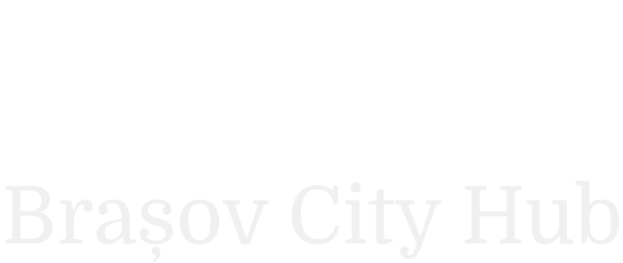
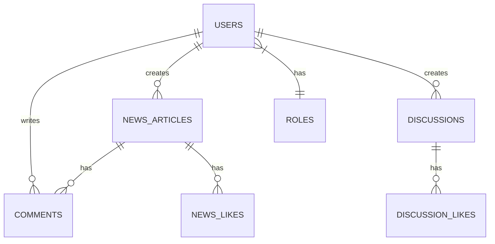

<div align="center">
  

  [](https://laravel.com)
  [](https://livewire.laravel.com)
  [](https://www.postgresql.org)
  [](https://tailwindcss.com)
  [](https://alpinejs.dev)
  [](https://www.gnu.org/licenses/gpl-3.0)

  A modern web platform connecting the community of Brasov through news, discussions, and local discoveries. 🌟
</div>

---

## ✨ Features

🗞️ **News System**
- Create and moderate local news articles
- Rich text editing with TinyMCE
- Interactive commenting system
- Like/unlike functionality for articles

🗣️ **Discussion Platform**
- Community-driven discussions
- Event categorization (Cultural, Sports, Movies, etc.)
- Real-time interaction with likes and comments

🎯 **Local Discovery**
- Google Cloud API integration
- Smart caching with Redis
- Discover nearby attractions and businesses

👥 **Advanced Role System**
- Modular permissions
- Granular access control
- Flexible role management

## 🚀 Tech Stack

### 🛠️ Backend
- 
- 

### 💫 Frontend
- 
- 
- 
- 

### 🌐 APIs
- 

## 📋 Prerequisites

Before you begin, ensure you have installed:

- 📌 PHP 8.2 or higher
- 📌 Node.js and npm
- 📌 Composer
- 📌 PostgreSQL 17.2

## 🚀 Installation

1. **Clone the repository:**
```bash
git clone https://github.com/alexandrubunea/brasov-city-hub.git
cd brasov-city-hub
```

2. **Install PHP dependencies:**
```bash
composer install
```

3. **Install Node.js dependencies:**
```bash
npm install
```

4. **Set up environment:**
```bash
cp .env.example .env
php artisan key:generate
php artisan storage:link
```

5. **Configure database in `.env`:**
```env
DB_CONNECTION=pgsql
DB_HOST=127.0.0.1
DB_PORT=5432
DB_DATABASE=your_database
DB_USERNAME=your_username
DB_PASSWORD=your_password
```

6. **Configure Google API KEY in `.env`:**
```env
GOOGLE_PLACES_API_KEY=YOUR_API_KEY
```

7. **Run migrations:**
```bash
php artisan migrate
```

8. **Build assets:**
```bash
npm run build
```

## 💻 Development

Start all services with a single command:
```bash
composer run dev
```

This launches:
- 🔷 Laravel development server
- 🔷 Queue worker
- 🔷 Log viewer
- 🔷 Vite development server

## 🗄️ Database Structure



## 🔑 Key Features

### 👥 Role Management
- 🛡️ Modular role system
- 🔐 Granular permissions for:
  - News creation/moderation
  - Discussion creation/moderation
  - User moderation
  - Role management

### 📝 Content Management
- ✨ Rich text editing with TinyMCE
- 📰 News article system
- 💬 Community discussions
- 🛡️ Content moderation tools

### 🗺️ Local Discovery
- 🌍 Google Cloud API integration
- ⚡ Redis caching
- 🎯 Nearby places discovery

## 🤝 Contributing

While this repository can be forked, pull requests will be carefully reviewed. Only critical improvements or fixes will be considered.

## 📄 License

This project is licensed under the GNU General Public License v3.0 - see the [LICENSE](LICENSE) file for details.
<br/><br/>
<div align="center">
Made with ❤️ for Brasov
</div>
